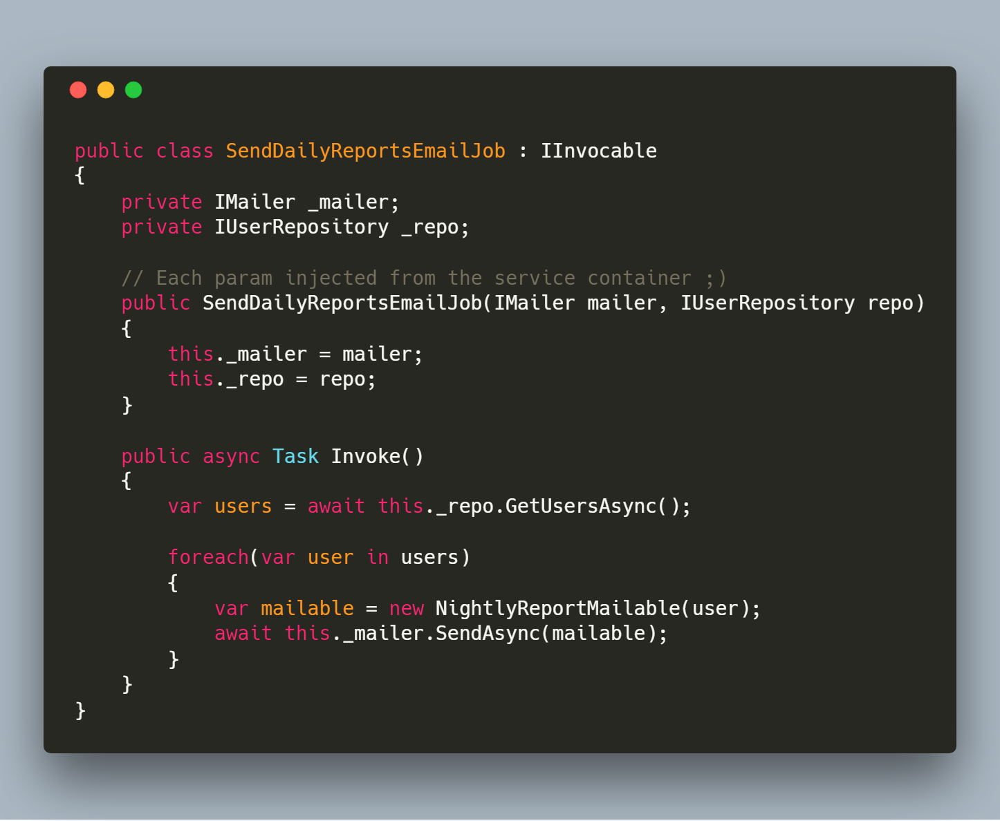
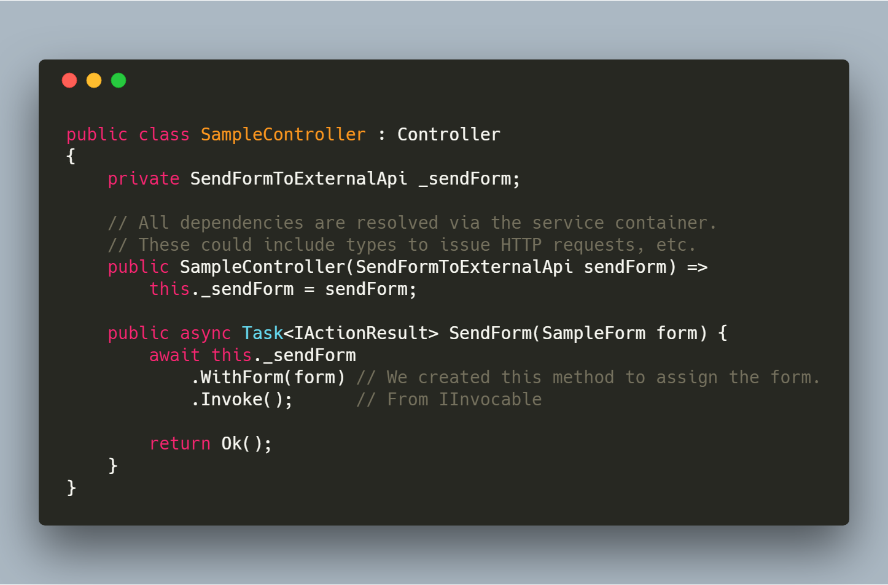
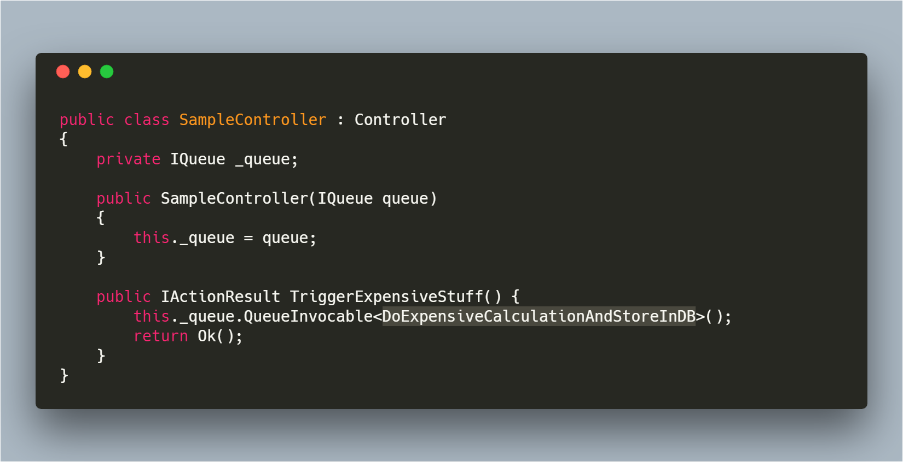

# Invocables

Invocables are ubiquitous classes that all of Coravel's features understand how to work with.

Invocables allow you to define specific self-contained jobs within your system. Since Coravel "understands" how to use invocables, you can do cool stuff like schedule or queue them using a super terse syntax.

## Creating An Invocable

Creating an invocable uses the shared interface `Coravel.Invocable.IInvocable`.

Using .Net Core's dependency injection services, your invocables will have all their dependencies injected whenever they are executed.

You may [use the Coravel Cli to generate a new invocable](./Cli.md).

Alternatively, to create an invocable by hand:

1. Implement the interface above in your class.

2. In your invocable's constructor, inject any types that are available from your application's service container.

3. Make sure that your invocable _itself_ is available in the service container.

4. Use it!

## Example: Generating A Daily Report And Emailing To Users

In this example, `SendDailyReportsEmailJob` is an invocable that was created by us. It handles getting data (via some repository that was injected via DI) and generating an e-mail, etc.

A sample implementation of the `SendDailyReportsEmailJob` class might look something like this (which is using Coravel's Mailer to send e-mail):

## Example: Sending A Form To An External API

There might be cases in your app when you have users fill out a form who's data needs to be sent to some external API. 

By using invocables you can separate your presentational logic (MVC controllers) from application or business logic in a simple and expressive way.

Using an invocable in an MVC controller might look like:

## Example: Trigger Long Running Calculations In Background

You might have a use-case where - from an admin screen - you want to have an HTML button that will fire off an expensive
calculation - at least too long to let your users wait for it to finish. Once completed, it might save the results to a database.

Assuming you created an invocable `DoExpensiveCalculationAndStoreInDB`, you could run it like this:

