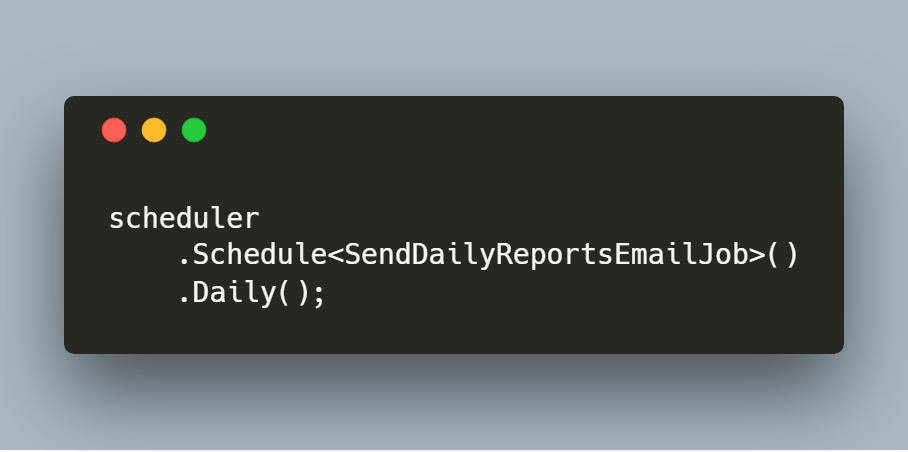

[](https://circleci.com/gh/jamesmh/coravel/tree/master)
[](https://builtwithdot.net/project/32/coravel)


<div align="center">
  
</div>

# Coravel

Coravel is a near-zero config .NET Core framework for Indie developers needing to get their next groundbreaking app to market faster - without compromising code quality and elegance.

Build .NET Core apps using a simple, expressive and straightforward syntax that lets you focus on **your app - "batteries included!"** 



## Used By

<p align="center">
  <a href="https://www.builtwithdot.net">
    
  </a>
</p>
<p align="center"><b>BuiltWithDot.Net</b></p>

## Features / Docs

- [Task Scheduling](./Docs/Scheduler.md)
- [Queuing](./Docs/Queuing.md)
- [Caching](./Docs/Caching.md)
- [Mailing](./Docs/Mailing.md)
- [Invocables](./Docs/Invocables.md)
- [Events](./Docs/Events.md)
- [Coravel CLI](./Docs/Cli.md)

## Requirements

Coravel is a .NET Standard library designed for .NET Core apps. You must be including Coravel into either an existing .NET Core application (version 2.1.0+) or within another .NET Standard project(s).

### Coravel CLI

Use the [Coravel CLI](./Docs/Cli.md) to get started!

Coravel CLI is a dotnet core tool that you can use as a global executable (similar to `npm` or `dotnet` etc.) that gives you easy installs, scaffolding abilities, etc.

Install the tool:

```
dotnet tool install --global coravel-cli
```

### Installation

Coravel requires the nuget package `Coravel` to get started.

Alternatively, you may install Coravel using the CLI (which will install the package for you):

```
coravel install
```

Done!

### What Do I Do Next?

Check out the top of this readme for an index of Coravel's features, each linking to the appropriate docs!

## Contributing

If you are fixing a typo in one file / place - issue a PR.

Otherwise, please **always** create an issue first ;)
