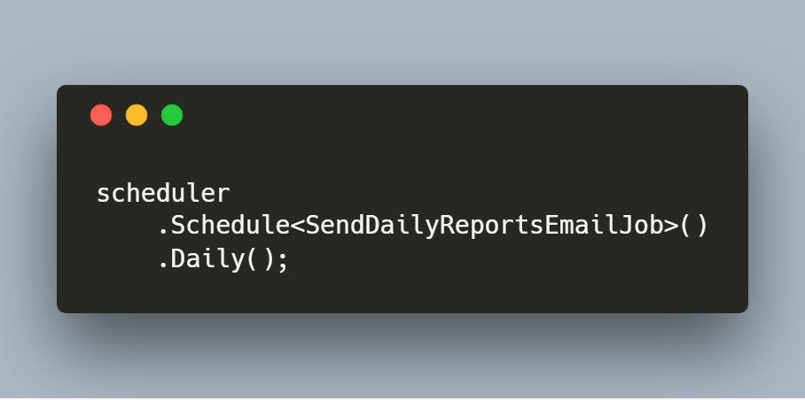

  

# Coravel

Coravel helps developers get their .NET Core applications up-and-running fast without compromising code quality. 

It makes advanced application features accessible and easy-to-use by giving you a simple, expressive and straightforward syntax.

## Used By

  

<b>BuiltWithDot.Net</b>

_Want to be featured? Open an issue!_

## Features:

### Task Scheduling

Usually, you have to configure a cron job or a task via Windows Task Scheduler to get a single or multiple re-occurring tasks to run.

With Coravel, you can setup all your scheduled tasks in one place using a simple, elegant, fluent syntax - in code!

### Queuing

Coravel gives you a zero-configuration queue that runs in-memory to offload long-winded tasks to the background instead of making your users wait for their HTTP request to finish!

### Caching

Coravel provides you with an easy to use API for caching in your .NET Core applications.

By default, it uses an in-memory cache, but also has database drivers for more robust scenarios!

### Event Broadcasting

Coravel's event broadcasting helps you to build maintainable applications who's parts are loosely coupled!

### Mailing

E-mails are not as easy as they should be. Luckily for you, Coravel solves this by offering:

- Built-in e-mail friendly razor templates
- Simple and flexible mailing API
- Render your e-mails for visual testing
- Drivers supporting SMTP, local log file or BYOM ("bring your own mailer") driver
- Quick and simple configuration via `appsettings.json`
- And more!

## Official Documention

[You can view the official docs here.](https://docs.coravel.net/Installation/)

## Samples

- [Using Coravel With EF Core](https://github.com/jamesmh/coravel/tree/master/Samples/EFCoreSample)
- [.NET Core Worker Service using Coravel's Task Scheduling (3.0+)](https://github.com/jamesmh/coravel/tree/master/Samples/WorkerServiceScheduler)
- [.NET Core Console app using the Host Builder and Coravel (< 3.0)](https://github.com/jamesmh/coravel/tree/master/Samples/HostBuilderConsole)

## Support Me

You can support my ongoing open-source work on [BuyMeACoffee](https://www.buymeacoffee.com/gIPOyBD5N).

## Coravel Pro

If you are building a .NET Core application with EF Core, then you might want to look into [Coravel Pro](https://www.pro.coravel.net/). It is an admin panel & tools to make maintaining and managing your .NET Core app a breeze!

- Visual job scheduling & management
- Scaffold a CRUD UI for managing your EF Core entities
- Easily configure a dashboard to show health metrics (or whatever you want)
- Build custom tablular reports of your data
- And more!
